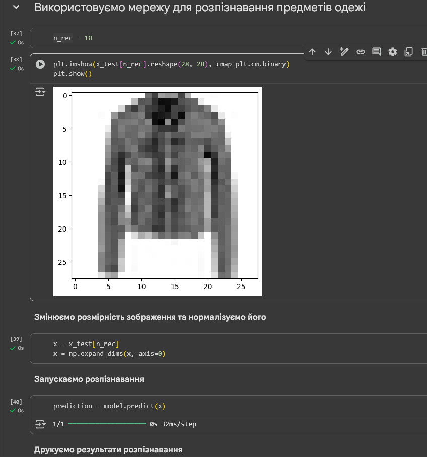
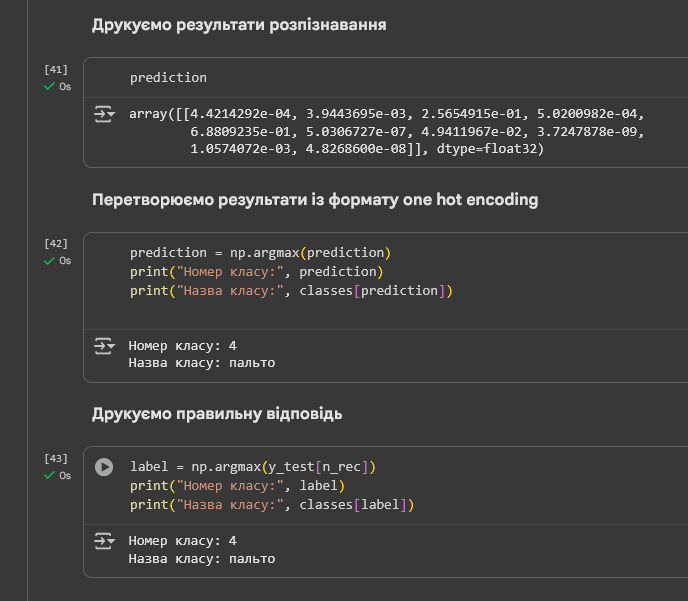
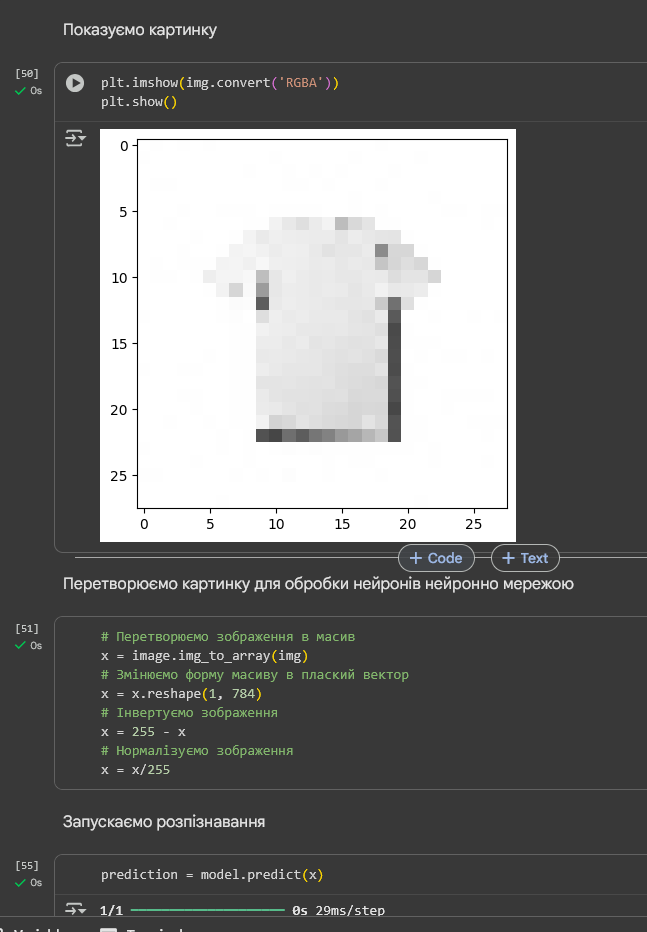
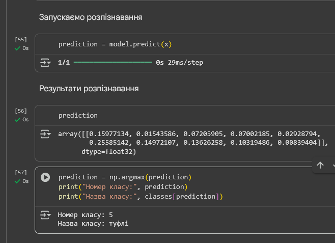

# Звіт з Лабораторної роботи 1: Розпізнавання предметів одягу на Keras

## Аналіз результатів базової версії програми

Базова версія нейронної мережі була навчена на наборі даних Fashion MNIST з наступними параметрами:

* **Архітектура:** Один прихований шар з 800 нейронами (активація "relu") та вихідний шар з 10 нейронами (активація "softmax").
* **Оптимізатор:** SGD.
* **Функція втрат:** categorical_crossentropy.
* **Кількість епох:** 100.
* **Розмір міні-вибірки (batch_size):** 200.
* **Розділення для валідації (validation_split):** 0.2.

### Частка вірних відповідей на тестових даних

Після 100 епох навчання, модель продемонструвала наступну точність на тестовому наборі даних:

* **Частка вірних відповідей на тестових даних:** 86.61%

### Аналіз `val_accuracy` під час навчання

Протягом процесу навчання спостерігались наступні тенденції зміни валідаційної точності (`val_accuracy`):

* **Початковий швидкий ріст:** На перших епохах `val_accuracy` швидко зростала: від 0.7366 на першій епосі до 0.8278 на десятій епосі. Це свідчить про ефективне навчання моделі на ранніх стадіях.
* **Подальше зростання та стабілізація:** Зростання тривало, але сповільнювалося.
* **Максимальне значення:** Найвище значення `val_accuracy` **0.8762** було досягнуто на **93-й епосі**.
* **Ознаки перенавчання (флуктуації/зниження):** Після 93-ї епохи `val_accuracy` почало флуктуювати і дещо знижуватись (наприклад, до 0.8740 на 94-й епосі, 0.8720 на 100-й епосі). Це може свідчити про початок перенавчання моделі, коли вона починає запам'ятовувати "шум" у тренувальних даних замість узагальнення, що призводить до гіршої продуктивності на нових, невидимих даних (валідаційний набір).

### Розпізнавання зображень з набору Fashion MNIST

### Розпізнавання власного зображення

## Тюнінг

### Епохи

50: 87.13
75: 87.71
100: 86.69
125: 88.54

### Розмір міні-вибірки

50: 88.63
100: 88.0
200: 86.69
400: 87.68

### Кількість нейронів першого прихованого шару

500: 86.45
700: 86.63
800: 86.69
900: 86.51
1200: 86.84

### Додавання прихованого шару

500: 87.67
700: 87.66
900: 87.23
1200: 87.42

Час навчання не сильно збільшився. Ґуґл колаб показує "1m", так само як коли прихованого шару не було.
