# Docs

## VGG16

steps 50
batch size 20
dropout 0.5

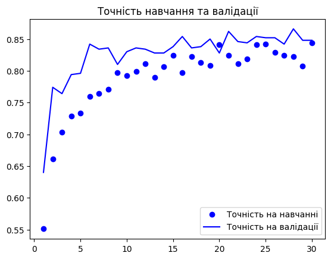
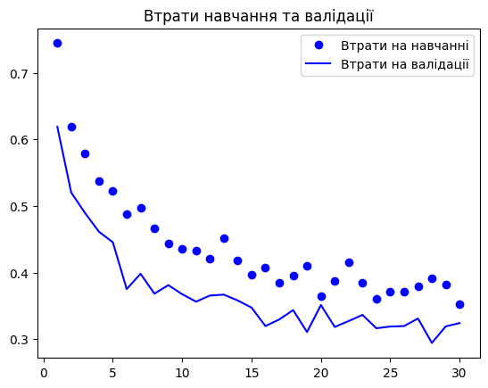

steps 50
batch size 20
dropout 0.8
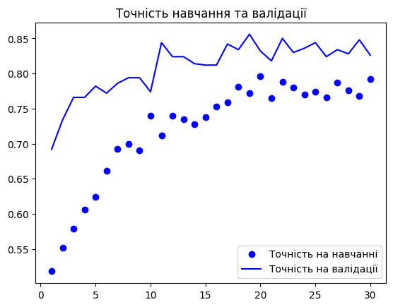
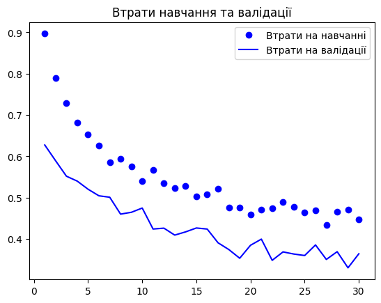

steps 50
batch size 20
dropout 0.2

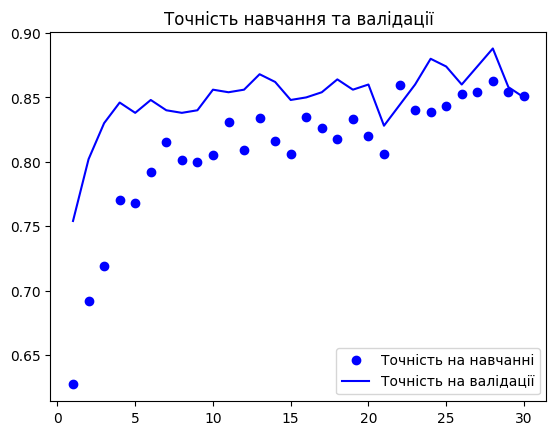
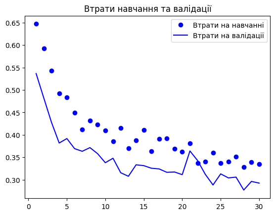

## InceptionV3

steps 50
batch size 16
dropout 0.5
learning_rate 1e-5

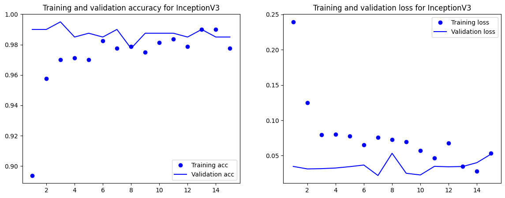

steps 50
batch size 16
dropout 0.8
learning_rate 1e-5

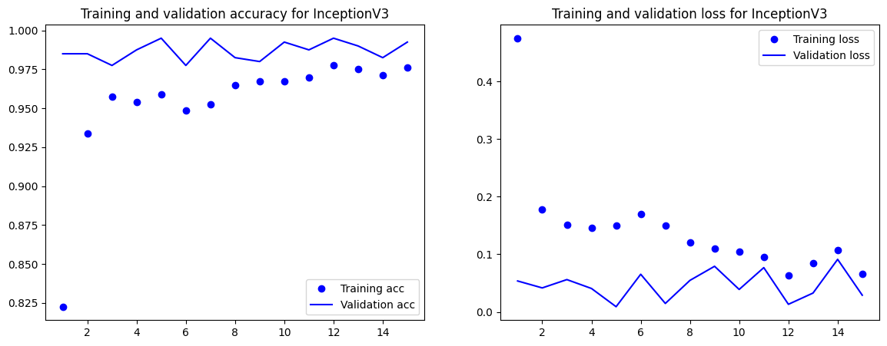

steps 50
batch size 16
dropout 0.2
learning_rate 1e-5

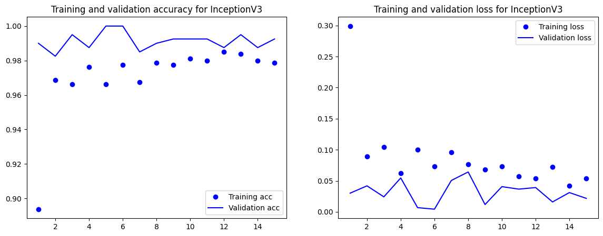

## Resnet

steps 50
batch size 16
dropout 0.5
learning_rate 2e-5
epochs 15
validation_steps 25

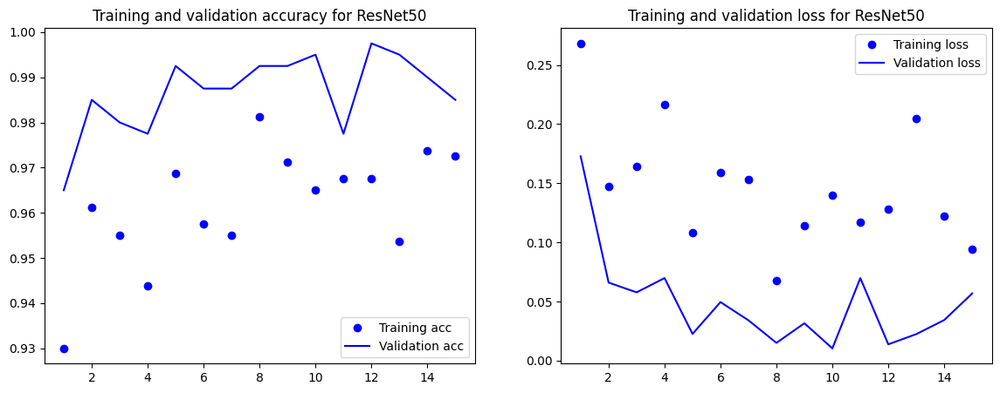

steps 50
batch size 16
dropout 0.2
learning_rate 2e-5
epochs 15
validation_steps 25

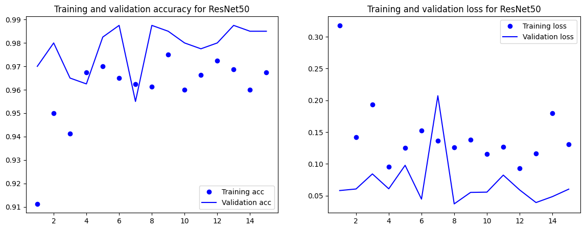

steps 50
batch size 16
dropout 0.8
learning_rate 2e-5
epochs 15
validation_steps 25

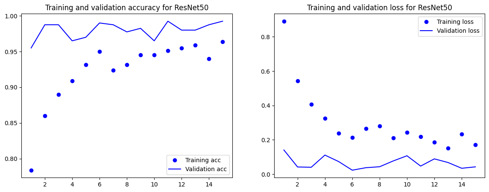

| Model | Best Validation Accuracy | Stability | Signs of Overfitting? | General Notes |
| :--- | :--- | :--- | :--- | :--- |
| **VGG16** | ~89% (with Dropout 0.2) | Fairly stable | Mild overfitting after 20 epochs. | A simple, strong baseline. |
| **ResNet50** | *[Fill this in]* | *[e.g., Very Stable / Unstable]* | *[Yes/No/Slightly]* | *[e.g., Converged faster than VGG16]* |
| **InceptionV3** | *[Fill this in]* | *[e.g., Very Stable]* | *[Yes/No/Slightly]* | *[e.g., Highest accuracy, but sensitive to input size]* |
