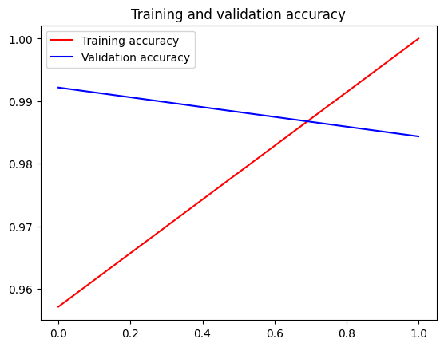
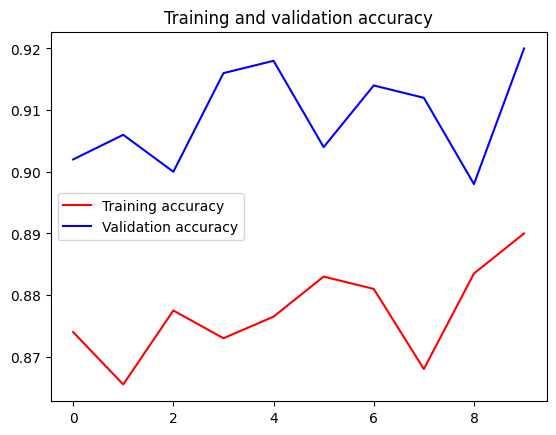
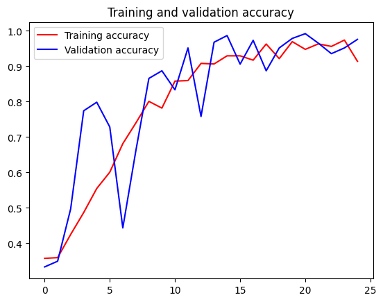
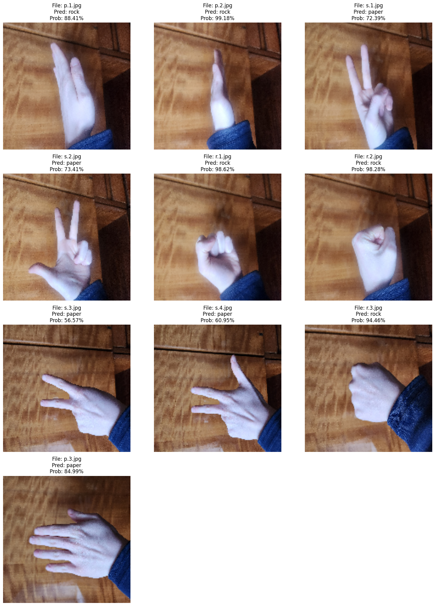
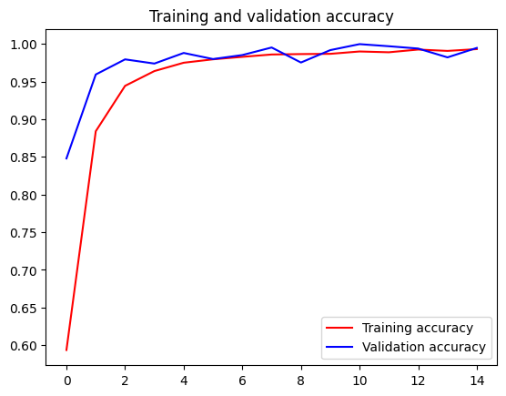
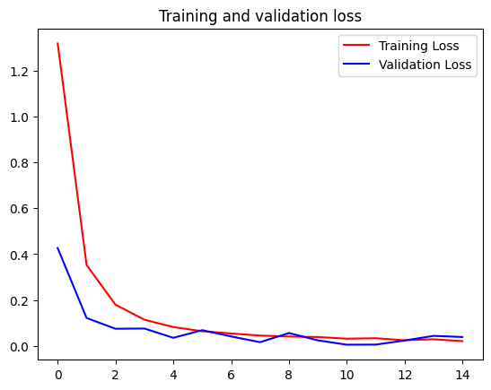

# Report

## Task 1-2

### No Augmentation, No Finetuning, image size 150



```sh
Found test_images directory at ./uploaded_files

--- Testing images in horse ---
1/1 ━━━━━━━━━━━━━━━━━━━━ 5s 5s/step
horse.4.png: Predicted HORSE (0.1600)
1/1 ━━━━━━━━━━━━━━━━━━━━ 0s 35ms/step
horse.2.png: Predicted HORSE (0.0002)
1/1 ━━━━━━━━━━━━━━━━━━━━ 0s 36ms/step
horse.3.png: Predicted HORSE (0.0000)
1/1 ━━━━━━━━━━━━━━━━━━━━ 0s 35ms/step
horse.5.png: Predicted HORSE (0.0000)
1/1 ━━━━━━━━━━━━━━━━━━━━ 0s 33ms/step
horse.1.png: Predicted HORSE (0.0000)

--- Testing images in person ---
1/1 ━━━━━━━━━━━━━━━━━━━━ 0s 34ms/step
person.5.png: Predicted HUMAN (0.9906)
1/1 ━━━━━━━━━━━━━━━━━━━━ 0s 46ms/step
person.3.png: Predicted HUMAN (0.8281)
1/1 ━━━━━━━━━━━━━━━━━━━━ 0s 38ms/step
person.4.png: Predicted HUMAN (0.8946)
1/1 ━━━━━━━━━━━━━━━━━━━━ 0s 38ms/step
person.1.png: Predicted HUMAN (0.9916)
1/1 ━━━━━━━━━━━━━━━━━━━━ 0s 38ms/step
person.2.png: Predicted HUMAN (0.9955)
```

### Augmentation, No Finetuning, image size 300

### Augmentation, No Finetuning, image size 150

### Augmentation, Finetuning, image size 150


## Task 3

steps_per_epoch=100
epochs=10
validation_steps=25
batch_size=20

### No Augmentation, No Finetuning

```sh
Epoch 10/10
100/100 - 8s - 80ms/step - accuracy: 0.9435 - loss: 0.1429 - val_accuracy: 0.8700 - val_loss: 0.2870
```

```sh
Total images processed: 1000
Real Model Accuracy: 87.10%
```

```sh
--- Testing images in cat ---
1/1 ━━━━━━━━━━━━━━━━━━━━ 0s 41ms/step
cat.3.png: Predicted CAT (0.1452)
1/1 ━━━━━━━━━━━━━━━━━━━━ 0s 37ms/step
cat.5.png: Predicted CAT (0.0445)
1/1 ━━━━━━━━━━━━━━━━━━━━ 0s 36ms/step
cat.1.png: Predicted CAT (0.0008)
1/1 ━━━━━━━━━━━━━━━━━━━━ 0s 37ms/step
cat.4.png: Predicted CAT (0.2412)
1/1 ━━━━━━━━━━━━━━━━━━━━ 0s 36ms/step
cat.2.png: Predicted CAT (0.0003)

--- Testing images in dog ---
1/1 ━━━━━━━━━━━━━━━━━━━━ 0s 38ms/step
dog.1.png: Predicted DOG (0.9961)
1/1 ━━━━━━━━━━━━━━━━━━━━ 0s 44ms/step
dog.2.png: Predicted DOG (0.9232)
1/1 ━━━━━━━━━━━━━━━━━━━━ 0s 48ms/step
dog.5.png: Predicted DOG (0.9655)
1/1 ━━━━━━━━━━━━━━━━━━━━ 0s 55ms/step
dog.4.png: Predicted CAT (0.0348)
1/1 ━━━━━━━━━━━━━━━━━━━━ 0s 50ms/step
dog.3.png: Predicted DOG (0.8985)
```


### Augmentation, No Finetuning

```sh
Epoch 10/10
100/100 ━━━━━━━━━━━━━━━━━━━━ 16s 162ms/step - accuracy: 0.8649 - loss: 0.2992 - val_accuracy: 0.8900 - val_loss: 0.2591
```

```sh
--- Testing images in cat ---
1/1 ━━━━━━━━━━━━━━━━━━━━ 0s 43ms/step
cat.5.png: Predicted CAT (0.2477)
1/1 ━━━━━━━━━━━━━━━━━━━━ 0s 42ms/step
cat.2.png: Predicted CAT (0.0083)
1/1 ━━━━━━━━━━━━━━━━━━━━ 0s 41ms/step
cat.3.png: Predicted CAT (0.2974)
1/1 ━━━━━━━━━━━━━━━━━━━━ 0s 43ms/step
cat.1.png: Predicted CAT (0.0022)
1/1 ━━━━━━━━━━━━━━━━━━━━ 0s 40ms/step
cat.4.png: Predicted CAT (0.2366)

--- Testing images in dog ---
1/1 ━━━━━━━━━━━━━━━━━━━━ 0s 46ms/step
dog.3.png: Predicted DOG (0.7902)
1/1 ━━━━━━━━━━━━━━━━━━━━ 0s 42ms/step
dog.1.png: Predicted DOG (0.9913)
1/1 ━━━━━━━━━━━━━━━━━━━━ 0s 44ms/step
dog.2.png: Predicted DOG (0.9321)
1/1 ━━━━━━━━━━━━━━━━━━━━ 0s 52ms/step
dog.4.png: Predicted CAT (0.1730)
1/1 ━━━━━━━━━━━━━━━━━━━━ 0s 43ms/step
dog.5.png: Predicted DOG (0.9265)
```

```sh
Total images processed: 1000
Real Model Accuracy: 87.30%
```


### Augmentation, Finetuning

```sh
Epoch 10/10
100/100 ━━━━━━━━━━━━━━━━━━━━ 17s 168ms/step - accuracy: 0.8855 - loss: 0.2717 - val_accuracy: 0.9200 - val_loss: 0.2156
```

```sh
--- Testing images in cat ---
1/1 ━━━━━━━━━━━━━━━━━━━━ 0s 37ms/step
cat.3.png: Predicted DOG (0.6175)
1/1 ━━━━━━━━━━━━━━━━━━━━ 0s 36ms/step
cat.5.png: Predicted CAT (0.1237)
1/1 ━━━━━━━━━━━━━━━━━━━━ 0s 40ms/step
cat.1.png: Predicted CAT (0.0011)
1/1 ━━━━━━━━━━━━━━━━━━━━ 0s 39ms/step
cat.4.png: Predicted CAT (0.4340)
1/1 ━━━━━━━━━━━━━━━━━━━━ 0s 38ms/step
cat.2.png: Predicted CAT (0.0022)

--- Testing images in dog ---
1/1 ━━━━━━━━━━━━━━━━━━━━ 0s 39ms/step
dog.1.png: Predicted DOG (0.9972)
1/1 ━━━━━━━━━━━━━━━━━━━━ 0s 39ms/step
dog.2.png: Predicted DOG (0.8932)
1/1 ━━━━━━━━━━━━━━━━━━━━ 0s 38ms/step
dog.5.png: Predicted DOG (0.9797)
1/1 ━━━━━━━━━━━━━━━━━━━━ 0s 40ms/step
dog.4.png: Predicted CAT (0.0576)
1/1 ━━━━━━━━━━━━━━━━━━━━ 0s 38ms/step
dog.3.png: Predicted DOG (0.5385)
```

```sh
Total images processed: 1000
Real Model Accuracy: 83.60%
```



### Експеримент 1: VGG16 (Shallow Fine-Tuning)

* **Параметри:** Dropout 0.5 (з Lab 08), RMSprop.

* **FT:** Розморожуємо тільки останній **block5_conv1**.

```sh
====================
STARTING EXPERIMENT: Exp 1: VGG16 Shallow FT
====================

Found 4000 images belonging to 2 classes.
Found 1000 images belonging to 2 classes.
Found 1000 images belonging to 2 classes.
--- Phase 1: Training Head (Exp 1: VGG16 Shallow FT) ---
/usr/local/lib/python3.12/dist-packages/keras/src/trainers/data_adapters/py_dataset_adapter.py:121: UserWarning: Your `PyDataset` class should call `super().__init__(**kwargs)` in its constructor. `**kwargs` can include `workers`, `use_multiprocessing`, `max_queue_size`. Do not pass these arguments to `fit()`, as they will be ignored.
  self._warn_if_super_not_called()
Epoch 1/6
  5/125 ━━━━━━━━━━━━━━━━━━━━ 23s 194ms/step - accuracy: 0.5156 - loss: 13.1481
/usr/local/lib/python3.12/dist-packages/PIL/TiffImagePlugin.py:950: UserWarning: Truncated File Read
  warnings.warn(str(msg))
125/125 ━━━━━━━━━━━━━━━━━━━━ 46s 290ms/step - accuracy: 0.7704 - loss: 4.3010 - val_accuracy: 0.9500 - val_loss: 0.6974
Epoch 2/6
125/125 ━━━━━━━━━━━━━━━━━━━━ 32s 255ms/step - accuracy: 0.9128 - loss: 1.0557 - val_accuracy: 0.9610 - val_loss: 0.5073
Epoch 3/6
125/125 ━━━━━━━━━━━━━━━━━━━━ 33s 263ms/step - accuracy: 0.9134 - loss: 0.7355 - val_accuracy: 0.9600 - val_loss: 0.4233
Epoch 4/6
125/125 ━━━━━━━━━━━━━━━━━━━━ 32s 258ms/step - accuracy: 0.9289 - loss: 0.5620 - val_accuracy: 0.9580 - val_loss: 0.3505
Epoch 5/6
125/125 ━━━━━━━━━━━━━━━━━━━━ 32s 256ms/step - accuracy: 0.9257 - loss: 0.4656 - val_accuracy: 0.9630 - val_loss: 0.2568
Epoch 6/6
125/125 ━━━━━━━━━━━━━━━━━━━━ 33s 259ms/step - accuracy: 0.9307 - loss: 0.3723 - val_accuracy: 0.9580 - val_loss: 0.2684
--- Phase 2: Fine Tuning (Exp 1: VGG16 Shallow FT) ---
Epoch 1/15
125/125 ━━━━━━━━━━━━━━━━━━━━ 39s 272ms/step - accuracy: 0.9408 - loss: 0.3288 - val_accuracy: 0.9580 - val_loss: 0.2850 - learning_rate: 1.0000e-05
Epoch 2/15
125/125 ━━━━━━━━━━━━━━━━━━━━ 34s 273ms/step - accuracy: 0.9380 - loss: 0.2544 - val_accuracy: 0.9680 - val_loss: 0.1641 - learning_rate: 1.0000e-05
Epoch 3/15
125/125 ━━━━━━━━━━━━━━━━━━━━ 33s 266ms/step - accuracy: 0.9419 - loss: 0.2546 - val_accuracy: 0.9680 - val_loss: 0.1705 - learning_rate: 1.0000e-05
Epoch 4/15
125/125 ━━━━━━━━━━━━━━━━━━━━ 33s 259ms/step - accuracy: 0.9484 - loss: 0.1762 - val_accuracy: 0.9640 - val_loss: 0.1888 - learning_rate: 1.0000e-05
Epoch 5/15
125/125 ━━━━━━━━━━━━━━━━━━━━ 33s 260ms/step - accuracy: 0.9564 - loss: 0.1431 - val_accuracy: 0.9640 - val_loss: 0.1880 - learning_rate: 2.0000e-06
Epoch 6/15
125/125 ━━━━━━━━━━━━━━━━━━━━ 33s 265ms/step - accuracy: 0.9480 - loss: 0.1791 - val_accuracy: 0.9690 - val_loss: 0.1649 - learning_rate: 2.0000e-06
--- Evaluating (Exp 1: VGG16 Shallow FT) ---
32/32 ━━━━━━━━━━━━━━━━━━━━ 3s 102ms/step - accuracy: 0.9775 - loss: 0.1157
Test Accuracy: 98.10%
```

## Task 4






**Причини низької точності на реальних фото:**

Головна проблема — Domain Shift (невідповідність даних навчання та тестування).

1. **Фон:** Модель навчалася на ідеальному білому тлі. Текстура дерев'яного столу на фото сприймається нею як частина об'єкта (шум), що збиває класифікацію.
2. **Сторонні об'єкти та тіні:** Рукав одягу та тіні від пальців змінюють силует руки, роблячи його незнайомим для нейромережі.
3. **Синтетична природа даних:** Модель перенавчилася (overfitting) на гладких 3D-моделях рук (CGI) і не змогла адаптуватися до текстури реальної шкіри та природного освітлення.

**Висновок:** Модель має слабку узагальнюючу здатність (generalization). Для роботи в реальних умовах необхідне навчання на реальних фотографіях або попереднє видалення фону.

## Task 5





### Висновки

#### Ефективність моделі та досягнення метрик

Розроблена згортувальна нейронна мережа (CNN) продемонструвала відмінні результати.

* **Точність на навчанні (Training Accuracy):** Досягла майже **100%** (близько 1.0 на графіку).
* **Точність на валідації (Validation Accuracy):** Стабільно трималася вище **96-98%**, досягаючи піку близько **99%**.

**Аналіз впливу аугментації даних**
Графік навчання демонструє цікаву, але очікувану поведінку, характерну для використання **Image Augmentation**:

* На початкових епохах точність валідації (синя лінія) була **вищою**, ніж точність навчання (червона лінія).
* Це пояснюється тим, що під час навчання до зображень застосовувалися випадкові трансформації (повороти, зсуви, масштабування), що ускладнювало завдання для моделі. Валідаційний набір складався з "чистих" зображень, які моделі було легше класифікувати.
* Ближче до 10-ї епохи графіки зблизилися, що свідчить про те, що модель вивчила стійкі ознаки жестів, які є інваріантними до поворотів та масштабування.

#### Архітектура та перенавчання (Overfitting)

Використання відносно простої архітектури (2 шари Conv2D + 2 шари MaxPooling) виявилося достатнім для вирішення задачі класифікації 26 класів на зображеннях 28x28.

Завдяки аугментації даних вдалося уникнути перенавчання (overfitting). На графіку **Validation Loss** не спостерігається зростання на пізніх епохах, а точність валідації не падає, а йде врівень з точністю навчання. Це підтверджує хорошу узагальнюючу здатність моделі в межах цього датасету.

#### Завдяки чому вдалося досягти високих показників (99% / 95%)

1. **Аугментація даних:** Це ключовий фактор. Використання генератора з випадковими поворотами, зумом та зсувами (`rotation`, `zoom`, `shift`) штучно збільшило різноманітність навчальних даних. Це змусило модель вчити узагальнену *форму* руки, а не просто запам'ятовувати пікселі, що забезпечило високу точність на валідації (>95%).
2. **Архітектура:** Для зображень низької роздільної здатності (28x28) використання двох шарів згортки (`Conv2D`) виявилося ідеальним — мережа змогла виділити контури пальців, не будучи при цьому надто складною (що викликало б перенавчання).
3. **Класифікатор:** Прихований шар `Dense` на 512 нейронів надав моделі достатню ємність для розрізнення нюансів між схожими жестами у багатокласовій класифікації (26 класів).
4. **Якість вхідних даних:** Датасет Sign Language MNIST є попередньо обробленим (кропнуті зображення, руки по центру, відсутність шумного фону), що є набагато легшим завданням для CNN порівняно з класифікацією сирих фотографій з реального життя.

