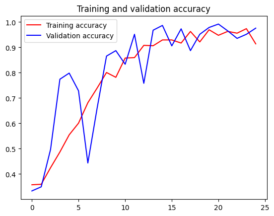
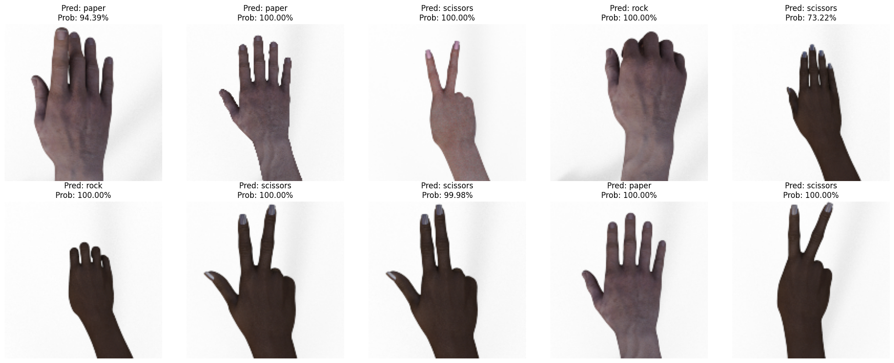

# Report

## No Finetuning

### Augmentation

```txt
--- Testing images in horse ---
1/1 ━━━━━━━━━━━━━━━━━━━━ 0s 43ms/step
cat.5.png: Predicted CAT (0.2477)
1/1 ━━━━━━━━━━━━━━━━━━━━ 0s 42ms/step
cat.2.png: Predicted CAT (0.0083)
1/1 ━━━━━━━━━━━━━━━━━━━━ 0s 41ms/step
cat.3.png: Predicted CAT (0.2974)
1/1 ━━━━━━━━━━━━━━━━━━━━ 0s 43ms/step
cat.1.png: Predicted CAT (0.0022)
1/1 ━━━━━━━━━━━━━━━━━━━━ 0s 40ms/step
cat.4.png: Predicted CAT (0.2366)

--- Testing images in person ---
1/1 ━━━━━━━━━━━━━━━━━━━━ 0s 46ms/step
dog.3.png: Predicted DOG (0.7902)
1/1 ━━━━━━━━━━━━━━━━━━━━ 0s 42ms/step
dog.1.png: Predicted DOG (0.9913)
1/1 ━━━━━━━━━━━━━━━━━━━━ 0s 44ms/step
dog.2.png: Predicted DOG (0.9321)
1/1 ━━━━━━━━━━━━━━━━━━━━ 0s 52ms/step
dog.4.png: Predicted CAT (0.1730)
1/1 ━━━━━━━━━━━━━━━━━━━━ 0s 43ms/step
dog.5.png: Predicted DOG (0.9265)
```

```txt
Total images processed: 1000
Real Model Accuracy: 87.30%
```

### No Augmentation

```txt
Epoch 10/10
100/100 - 8s - 80ms/step - accuracy: 0.9435 - loss: 0.1429 - val_accuracy: 0.8700 - val_loss: 0.2870
```

```txt
Total images processed: 1000
Real Model Accuracy: 91.00%
```

## Task 4



