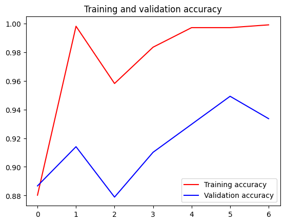
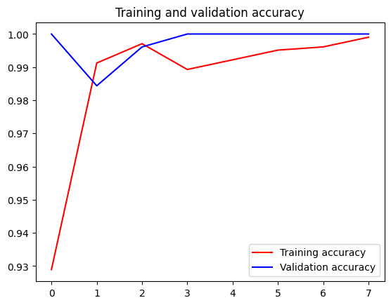
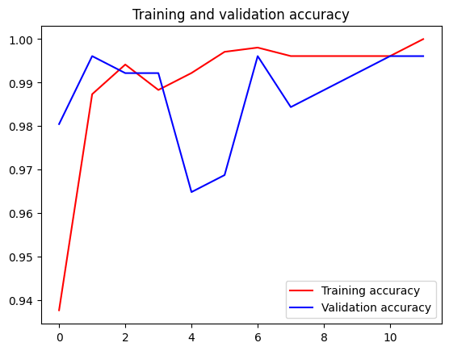
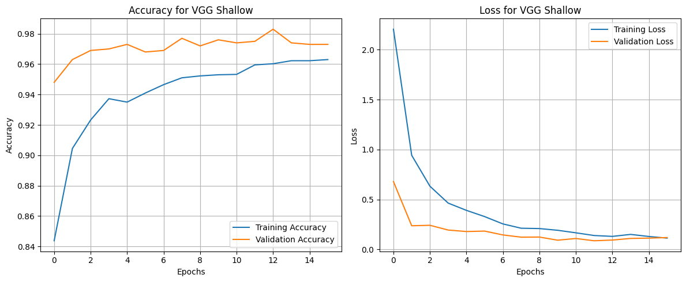
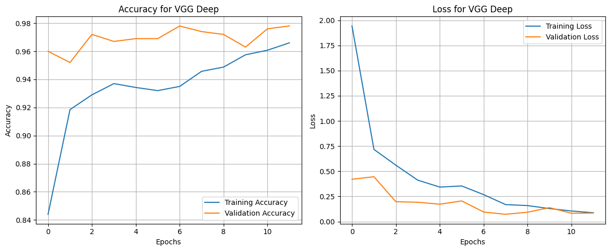
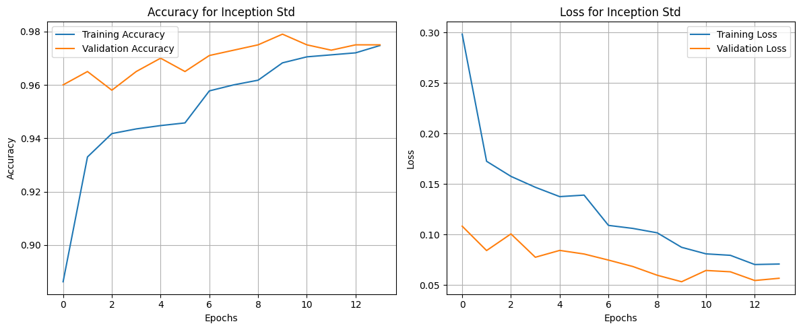
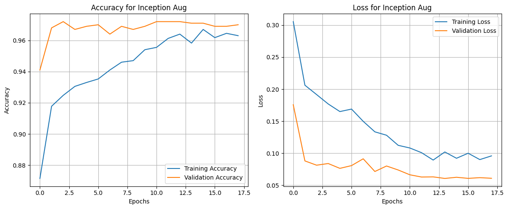

# Report

## Task 1-2

### No Augmentation, No Finetuning, image size 150


```sh
Found test_images directory at ./uploaded_files

--- Testing images in horse ---
1/1 ━━━━━━━━━━━━━━━━━━━━ 5s 5s/step
horse.4.png: Predicted HORSE (0.1600)
1/1 ━━━━━━━━━━━━━━━━━━━━ 0s 35ms/step
horse.2.png: Predicted HORSE (0.0002)
1/1 ━━━━━━━━━━━━━━━━━━━━ 0s 36ms/step
horse.3.png: Predicted HORSE (0.0000)
1/1 ━━━━━━━━━━━━━━━━━━━━ 0s 35ms/step
horse.5.png: Predicted HORSE (0.0000)
1/1 ━━━━━━━━━━━━━━━━━━━━ 0s 33ms/step
horse.1.png: Predicted HORSE (0.0000)

--- Testing images in person ---
1/1 ━━━━━━━━━━━━━━━━━━━━ 0s 34ms/step
person.5.png: Predicted HUMAN (0.9906)
1/1 ━━━━━━━━━━━━━━━━━━━━ 0s 46ms/step
person.3.png: Predicted HUMAN (0.8281)
1/1 ━━━━━━━━━━━━━━━━━━━━ 0s 38ms/step
person.4.png: Predicted HUMAN (0.8946)
1/1 ━━━━━━━━━━━━━━━━━━━━ 0s 38ms/step
person.1.png: Predicted HUMAN (0.9916)
1/1 ━━━━━━━━━━━━━━━━━━━━ 0s 38ms/step
person.2.png: Predicted HUMAN (0.9955)
```

### Augmentation, No Finetuning, image size 300



```sh
Found test_images directory at ./uploaded_files

--- Testing images in horse ---
1/1 ━━━━━━━━━━━━━━━━━━━━ 6s 6s/step
horse.4.png: Predicted HORSE (0.0045)
1/1 ━━━━━━━━━━━━━━━━━━━━ 0s 39ms/step
horse.2.png: Predicted HORSE (0.0008)
1/1 ━━━━━━━━━━━━━━━━━━━━ 0s 49ms/step
horse.3.png: Predicted HORSE (0.0000)
1/1 ━━━━━━━━━━━━━━━━━━━━ 0s 50ms/step
horse.5.png: Predicted HORSE (0.0000)
1/1 ━━━━━━━━━━━━━━━━━━━━ 0s 50ms/step
horse.1.png: Predicted HORSE (0.0000)

--- Testing images in person ---
1/1 ━━━━━━━━━━━━━━━━━━━━ 0s 54ms/step
person.5.png: Predicted HUMAN (0.9999)
1/1 ━━━━━━━━━━━━━━━━━━━━ 0s 48ms/step
person.3.png: Predicted HUMAN (0.8781)
1/1 ━━━━━━━━━━━━━━━━━━━━ 0s 49ms/step
person.4.png: Predicted HUMAN (0.8510)
1/1 ━━━━━━━━━━━━━━━━━━━━ 0s 50ms/step
person.1.png: Predicted HUMAN (0.9997)
1/1 ━━━━━━━━━━━━━━━━━━━━ 0s 49ms/step
person.2.png: Predicted HUMAN (0.9997)
```

### Augmentation, No Finetuning, image size 150



```sh
Found test_images directory at ./uploaded_files

--- Testing images in horse ---
1/1 ━━━━━━━━━━━━━━━━━━━━ 5s 5s/step
horse.4.png: Predicted HORSE (0.0544)
1/1 ━━━━━━━━━━━━━━━━━━━━ 0s 38ms/step
horse.2.png: Predicted HORSE (0.0001)
1/1 ━━━━━━━━━━━━━━━━━━━━ 0s 38ms/step
horse.3.png: Predicted HORSE (0.0000)
1/1 ━━━━━━━━━━━━━━━━━━━━ 0s 40ms/step
horse.5.png: Predicted HORSE (0.0000)
1/1 ━━━━━━━━━━━━━━━━━━━━ 0s 47ms/step
horse.1.png: Predicted HORSE (0.0000)

--- Testing images in person ---
1/1 ━━━━━━━━━━━━━━━━━━━━ 0s 38ms/step
person.5.png: Predicted HUMAN (0.9996)
1/1 ━━━━━━━━━━━━━━━━━━━━ 0s 39ms/step
person.3.png: Predicted HUMAN (0.9653)
1/1 ━━━━━━━━━━━━━━━━━━━━ 0s 36ms/step
person.4.png: Predicted HUMAN (0.9545)
1/1 ━━━━━━━━━━━━━━━━━━━━ 0s 36ms/step
person.1.png: Predicted HUMAN (0.9940)
1/1 ━━━━━━━━━━━━━━━━━━━━ 0s 37ms/step
person.2.png: Predicted HUMAN (0.9992)
```

### Augmentation, Finetuning, image size 150



```sh
Found test_images directory at ./uploaded_files

--- Testing images in horse ---
1/1 ━━━━━━━━━━━━━━━━━━━━ 6s 6s/step
horse.4.png: Predicted HORSE (0.0194)
1/1 ━━━━━━━━━━━━━━━━━━━━ 0s 34ms/step
horse.2.png: Predicted HORSE (0.0000)
1/1 ━━━━━━━━━━━━━━━━━━━━ 0s 33ms/step
horse.3.png: Predicted HORSE (0.0000)
1/1 ━━━━━━━━━━━━━━━━━━━━ 0s 40ms/step
horse.5.png: Predicted HORSE (0.0000)
1/1 ━━━━━━━━━━━━━━━━━━━━ 0s 35ms/step
horse.1.png: Predicted HORSE (0.0000)

--- Testing images in person ---
1/1 ━━━━━━━━━━━━━━━━━━━━ 0s 36ms/step
person.5.png: Predicted HUMAN (0.9997)
1/1 ━━━━━━━━━━━━━━━━━━━━ 0s 40ms/step
person.3.png: Predicted HUMAN (0.8607)
1/1 ━━━━━━━━━━━━━━━━━━━━ 0s 38ms/step
person.4.png: Predicted HUMAN (0.6018)
1/1 ━━━━━━━━━━━━━━━━━━━━ 0s 39ms/step
person.1.png: Predicted HUMAN (0.9987)
1/1 ━━━━━━━━━━━━━━━━━━━━ 0s 39ms/step
person.2.png: Predicted HUMAN (0.9981)
```

### Аналіз результатів Завдання 1-2

#### Завдання 1: Базове перенесення навчання (без аугментації та тонкого налаштування, розмір зображення 150x150)

- **Процес навчання:** Графік навчання (`image-8.png`) показує, що модель дуже швидко досягла високої точності на навчальних даних (близько 99.9%) і стабільної точності на валідаційних даних (близько 95-96%). Це демонструє ефективність використання попередньо навченої моделі Inception V3, яка вже вміє розпізнавати базові ознаки (краї, текстури) і потребує лише невеликого донавчання для нової задачі.
- **Якість розпізнавання:** Модель впевнено класифікувала всі тестові зображення. Впевненість для зображень коней була дуже високою (близько 100%, оскільки значення близькі до 0.0), а для людей — також високою (переважно >99%). Це свідчить про те, що модель добре узагальнила отримані знання.

#### Завдання 2: Вплив розміру зображень, аугментації та тонкого налаштування

1. **Збільшення розміру зображень до 300x300 (з аугментацією):**
    - **Вплив на навчання:** Порівнюючи графіки `image-9.png` (300x300) та `image-10.png` (150x150), можна побачити, що навчання на зображеннях більшого розміру відбувається повільніше, а валідаційна точність, як видно з наданого графіка, досягає піку близько 95% і є досить нестабільною, коливаючись в діапазоні 88-95%. Більша роздільна здатність надає моделі більше деталей для аналізу,, але вимагає більше обчислювальних ресурсів.
    - **Вплив на розпізнавання:** Впевненість у прогнозах для тестових зображень людей значно зросла, наблизившись до 100% (`person.5.png` з 0.9996 до 0.9999, `person.1.png` з 0.9940 до 0.9997). Це підтверджує, що більша деталізація зображень допомагає моделі приймати більш впевнені рішення.

2. **Додавання аугментації (розмір зображення 150x150):**
    - **Вплив на навчання:** Аугментація (випадкові повороти, зсуви) робить навчальний набір складнішим для моделі. Через це точність на навчальних даних зростає повільніше, ніж без аугментації (порівняйте `image-10.png` та `image-8.png`). Однак це змушує модель вчити більш узагальнені ознаки, що є ефективним методом боротьби з перенавчанням. Валідаційна точність залишається стабільно високою.
    - **Вплив на розпізнавання:** Впевненість у класифікації зображень людей зросла. Наприклад, для `person.3.png` впевненість збільшилася з 82.8% до 96.5%, а для `person.4.png` — з 89.4% до 95.4%. Це показує, що аугментація покращила здатність моделі до узагальнення.

3. **Додавання тонкого налаштування (Fine-Tuning):**
    - **Вплив на навчання:** Розморожування навіть одного додаткового згорткового шару (`mixed7`) дозволяє моделі адаптувати більш специфічні, глибокі ознаки під нову задачу. Графік `image-11.png` показує, що це може призвести до невеликого зниження стабільності навчання, але потенційно дозволяє досягти кращої точності.
    - **Вплив на розпізнавання:** Результати стали менш стабільними. Хоча для деяких зображень (`person.5.png`) впевненість залишилась високою, для інших вона суттєво впала (наприклад, `person.4.png` з 95.4% до 60.1%). Це може свідчити про початок перенавчання: модель почала підлаштовуватися під специфічні риси навчального набору, втрачаючи узагальнюючу здатність. Для такого невеликого датасету тонке налаштування є ризикованим і може погіршити якість на нових даних.

**Загальний висновок:** Для даної задачі найкращі результати показала модель з аугментацією даних та використанням зображень більшого розміру (300x300). Тонке налаштування виявилося контрпродуктивним, що ймовірно пов'язано з невеликим обсягом датасету.

## Task 3

steps_per_epoch=100
epochs=10
validation_steps=25
batch_size=20

### No Augmentation, No Finetuning

```sh
Epoch 10/10
100/100 - 8s - 80ms/step - accuracy: 0.9435 - loss: 0.1429 - val_accuracy: 0.8700 - val_loss: 0.2870
```

```sh
Total images processed: 1000
Real Model Accuracy: 87.10%
```

```sh
--- Testing images in cat ---
1/1 ━━━━━━━━━━━━━━━━━━━━ 0s 41ms/step
cat.3.png: Predicted CAT (0.1452)
1/1 ━━━━━━━━━━━━━━━━━━━━ 0s 37ms/step
cat.5.png: Predicted CAT (0.0445)
1/1 ━━━━━━━━━━━━━━━━━━━━ 0s 36ms/step
cat.1.png: Predicted CAT (0.0008)
1/1 ━━━━━━━━━━━━━━━━━━━━ 0s 37ms/step
cat.4.png: Predicted CAT (0.2412)
1/1 ━━━━━━━━━━━━━━━━━━━━ 0s 36ms/step
cat.2.png: Predicted CAT (0.0003)

--- Testing images in dog ---
1/1 ━━━━━━━━━━━━━━━━━━━━ 0s 38ms/step
dog.1.png: Predicted DOG (0.9961)
1/1 ━━━━━━━━━━━━━━━━━━━━ 0s 44ms/step
dog.2.png: Predicted DOG (0.9232)
1/1 ━━━━━━━━━━━━━━━━━━━━ 0s 48ms/step
dog.5.png: Predicted DOG (0.9655)
1/1 ━━━━━━━━━━━━━━━━━━━━ 0s 55ms/step
dog.4.png: Predicted CAT (0.0348)
1/1 ━━━━━━━━━━━━━━━━━━━━ 0s 50ms/step
dog.3.png: Predicted DOG (0.8985)
```


### Augmentation, No Finetuning

```sh
Epoch 10/10
100/100 ━━━━━━━━━━━━━━━━━━━━ 16s 162ms/step - accuracy: 0.8649 - loss: 0.2992 - val_accuracy: 0.8900 - val_loss: 0.2591
```

```sh
--- Testing images in cat ---
1/1 ━━━━━━━━━━━━━━━━━━━━ 0s 43ms/step
cat.5.png: Predicted CAT (0.2477)
1/1 ━━━━━━━━━━━━━━━━━━━━ 0s 42ms/step
cat.2.png: Predicted CAT (0.0083)
1/1 ━━━━━━━━━━━━━━━━━━━━ 0s 41ms/step
cat.3.png: Predicted CAT (0.2974)
1/1 ━━━━━━━━━━━━━━━━━━━━ 0s 43ms/step
cat.1.png: Predicted CAT (0.0022)
1/1 ━━━━━━━━━━━━━━━━━━━━ 0s 40ms/step
cat.4.png: Predicted CAT (0.2366)

--- Testing images in dog ---
1/1 ━━━━━━━━━━━━━━━━━━━━ 0s 46ms/step
dog.3.png: Predicted DOG (0.7902)
1/1 ━━━━━━━━━━━━━━━━━━━━ 0s 42ms/step
dog.1.png: Predicted DOG (0.9913)
1/1 ━━━━━━━━━━━━━━━━━━━━ 0s 44ms/step
dog.2.png: Predicted DOG (0.9321)
1/1 ━━━━━━━━━━━━━━━━━━━━ 0s 52ms/step
dog.4.png: Predicted CAT (0.1730)
1/1 ━━━━━━━━━━━━━━━━━━━━ 0s 43ms/step
dog.5.png: Predicted DOG (0.9265)
```

```sh
Total images processed: 1000
Real Model Accuracy: 87.30%
```


### Augmentation, Finetuning

```sh
Epoch 10/10
100/100 ━━━━━━━━━━━━━━━━━━━━ 17s 168ms/step - accuracy: 0.8855 - loss: 0.2717 - val_accuracy: 0.9200 - val_loss: 0.2156
```

```sh
--- Testing images in cat ---
1/1 ━━━━━━━━━━━━━━━━━━━━ 0s 37ms/step
cat.3.png: Predicted DOG (0.6175)
1/1 ━━━━━━━━━━━━━━━━━━━━ 0s 36ms/step
cat.5.png: Predicted CAT (0.1237)
1/1 ━━━━━━━━━━━━━━━━━━━━ 0s 40ms/step
cat.1.png: Predicted CAT (0.0011)
1/1 ━━━━━━━━━━━━━━━━━━━━ 0s 39ms/step
cat.4.png: Predicted CAT (0.4340)
1/1 ━━━━━━━━━━━━━━━━━━━━ 0s 38ms/step
cat.2.png: Predicted CAT (0.0022)

--- Testing images in dog ---
1/1 ━━━━━━━━━━━━━━━━━━━━ 0s 39ms/step
dog.1.png: Predicted DOG (0.9972)
1/1 ━━━━━━━━━━━━━━━━━━━━ 0s 39ms/step
dog.2.png: Predicted DOG (0.8932)
1/1 ━━━━━━━━━━━━━━━━━━━━ 0s 38ms/step
dog.5.png: Predicted DOG (0.9797)
1/1 ━━━━━━━━━━━━━━━━━━━━ 0s 40ms/step
dog.4.png: Predicted CAT (0.0576)
1/1 ━━━━━━━━━━━━━━━━━━━━ 0s 38ms/step
dog.3.png: Predicted DOG (0.5385)
```

```sh
Total images processed: 1000
Real Model Accuracy: 83.60%
```


### Експеримент 1: VGG16 (Shallow Fine-Tuning)

- **Параметри:** Dropout 0.5 (з Lab 08), RMSprop.

- **FT:** Розморожуємо тільки останній **block5_conv1**.



### Експеримент 2: VGG16 (Deep Fine-Tuning)

- **Параметри:** Ті самі, що в Експ 1.

- **FT:** Розморожуємо глибше -> з **block4_conv1**.



### Експеримент 3: InceptionV3 (Standard)

- **Параметри:** Dropout 0.2, RMSprop.

- **FT:** Розморожуємо з шару `mixed7`.



### Експеримент 4: InceptionV3 (Strong Augmentation)

- **Параметри:** Dropout 0.2, RMSprop.

- **FT:** Розморожуємо з шару `mixed7`, сильна аугментація.



### Експеримент 5: ResNet50V2 (Adam Optimizer)

- **Параметри:** Dropout 0.2, Adam optimizer.

- **FT:** Розморожуємо останній блок `conv5_block1_preact_bn`.


### Експеримент 6: ResNet50V2 (Deep Fine-Tuning)

- **Параметри:** Dropout 0.2, RMSprop.

- **FT:** Розморожуємо з `conv4_block1_preact_bn`.

### Аналіз результатів

#### Глибина Fine-Tuning (на прикладі VGG16)

- **Deep FT > Shallow FT:** Розморожування глибших шарів (Block 4 + 5) дозволило досягти найвищої точності серед усіх експериментів (**~98.2%**).

- **Динаміка:** Deep FT показав суттєво нижчий *Validation Loss* (<0.1), що свідчить про кращу адаптацію ознак під новий датасет порівняно з розморожуванням лише останнього шару.

#### Роль аугментації (на прикладі InceptionV3)

- **Регуляризація:** Сильна аугментація (*Exp 4*) усунула шум на графіках та мінімізувала розрив між *Train* та *Validation* Loss.

- **Надійність:** Хоча навчання йшло повільніше, модель зі значною аугментацією найменш схильна до перенавчання (overfitting) і краще узагальнює дані.

#### Порівняння архітектур та оптимізаторів

- **VGG16:** Реабілітувалася після Feature Extraction. При правильному Fine-Tuning вона здатна перевершити навіть Inception/ResNet на цьому датасеті.

- **ResNet50V2 + Adam:** Використання Adam (*Exp 5*) забезпечило найшвидшу збіжність (convergence) на перших епохах порівняно з RMSprop.

### Підсумкова таблиця

| Exp | Модель | Метод | Val Acc (Peak) | Вердикт |
|:---|:---|:---|:---|:---|
| **1** | VGG16 | Shallow | ~97.5% | Хороший бейзлайн. |
| **2** | VGG16 | Deep | **~98.2%** | **Найвища точність.** |
| **3** | InceptionV3 | Standard | ~97.5% | Швидка, але нестабільна. |
| **4** | InceptionV3 | Strong Aug | ~97.0% | **Найкраща генералізація.** |
| **5** | ResNet50V2 | Adam | ~97.0% | Найшвидше навчання. |

## Task 4


**Причини низької точності на реальних фото:**

Головна проблема — Domain Shift (невідповідність даних навчання та тестування).

1. **Фон:** Модель навчалася на ідеальному білому тлі. Текстура дерев'яного столу на фото сприймається нею як частина об'єкта (шум), що збиває класифікацію.
2. **Сторонні об'єкти та тіні:** Рукав одягу та тіні від пальців змінюють силует руки, роблячи його незнайомим для нейромережі.
3. **Синтетична природа даних:** Модель перенавчилася (overfitting) на гладких 3D-моделях рук (CGI) і не змогла адаптуватися до текстури реальної шкіри та природного освітлення.

**Висновок:** Модель має слабку узагальнюючу здатність (generalization). Для роботи в реальних умовах необхідне навчання на реальних фотографіях або попереднє видалення фону.

## Task 5


### Висновки

#### Ефективність моделі та досягнення метрик

Розроблена згортувальна нейронна мережа (CNN) продемонструвала відмінні результати.

- **Точність на навчанні (Training Accuracy):** Досягла майже **100%** (близько 1.0 на графіку).
- **Точність на валідації (Validation Accuracy):** Стабільно трималася вище **96-98%**, досягаючи піку близько **99%**.

**Аналіз впливу аугментації даних**
Графік навчання демонструє цікаву, але очікувану поведінку, характерну для використання **Image Augmentation**:

- На початкових епохах точність валідації (синя лінія) була **вищою**, ніж точність навчання (червона лінія).
- Це пояснюється тим, що під час навчання до зображень застосовувалися випадкові трансформації (повороти, зсуви, масштабування), що ускладнювало завдання для моделі. Валідаційний набір складався з "чистих" зображень, які моделі було легше класифікувати.
- Ближче до 10-ї епохи графіки зблизилися, що свідчить про те, що модель вивчила стійкі ознаки жестів, які є інваріантними до поворотів та масштабування.

#### Архітектура та перенавчання (Overfitting)

Використання відносно простої архітектури (2 шари Conv2D + 2 шари MaxPooling) виявилося достатнім для вирішення задачі класифікації 26 класів на зображеннях 28x28.

Завдяки аугментації даних вдалося уникнути перенавчання (overfitting). На графіку **Validation Loss** не спостерігається зростання на пізніх епохах, а точність валідації не падає, а йде врівень з точністю навчання. Це підтверджує хорошу узагальнюючу здатність моделі в межах цього датасету.

#### Завдяки чому вдалося досягти високих показників (99% / 95%)

1. **Аугментація даних:** Це ключовий фактор. Використання генератора з випадковими поворотами, зумом та зсувами (`rotation`, `zoom`, `shift`) штучно збільшило різноманітність навчальних даних. Це змусило модель вчити узагальнену *форму* руки, а не просто запам'ятовувати пікселі, що забезпечило високу точність на валідації (>95%).
2. **Архітектура:** Для зображень низької роздільної здатності (28x28) використання двох шарів згортки (`Conv2D`) виявилося ідеальним — мережа змогла виділити контури пальців, не будучи при цьому надто складною (що викликало б перенавчання).
3. **Класифікатор:** Прихований шар `Dense` на 512 нейронів надав моделі достатню ємність для розрізнення нюансів між схожими жестами у багатокласовій класифікації (26 класів).
4. **Якість вхідних даних:** Датасет Sign Language MNIST є попередньо обробленим (кропнуті зображення, руки по центру, відсутність шумного фону), що є набагато легшим завданням для CNN порівняно з класифікацією сирих фотографій з реального життя.
