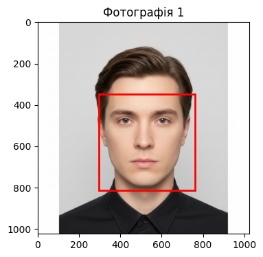
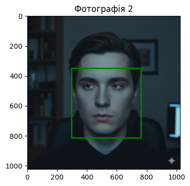
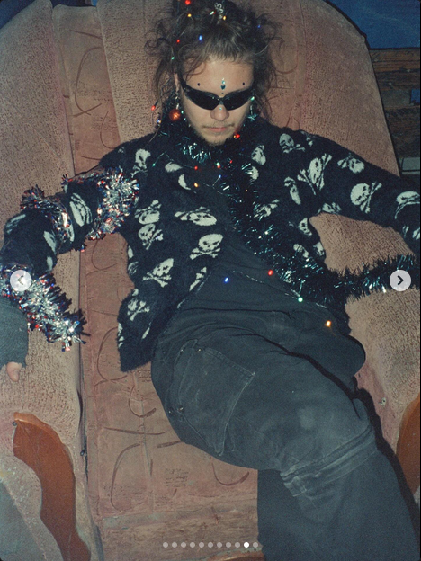
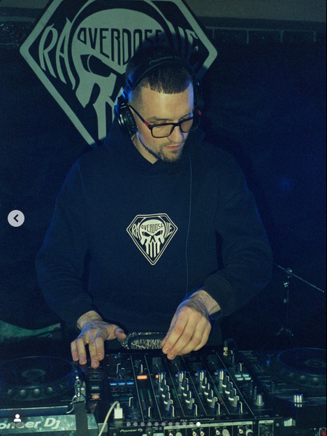
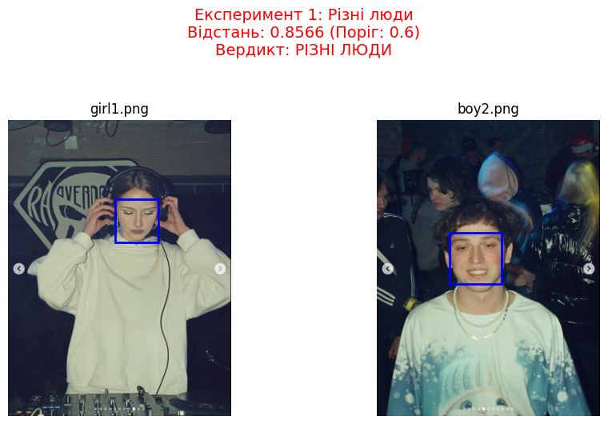
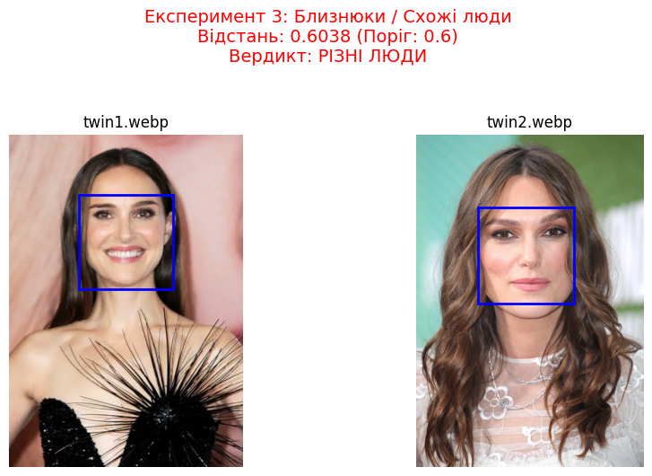

# Звіт з лабораторної роботи 11

## Базове порівння

Фото 1 і 2 були згенеровано за допомогою NanoBanana.

Фото1: як на паспорт
Фото2: вебкамера, погане освітлення, людина дивиться десь у бік





Модель успішно розпізнала на фотографіях одне обличчя

```sh
--- Результати Верифікації ---
Евклідова відстань між дескрипторами: 0.3339
Поріг dlib для верифікації: 0.6
ВЕРДИКТ: Відстань МЕНШЕ порогу. Ймовірно, на фотографіях ЗОБРАЖЕНА ОДНА ЛЮДИНА.
```

Висновки: ...

## Експерименти

### Експеримент 1: Різні люди




На цих фото модель не змогла розпізнати обличчя



Тут модель упевнено визначила, що це різні люди.

### Експеримент 2: Дуже схожі люди



На фото зліва Наталі Портман, на фото справа Кіра Найтлі. Модель була дуже близька до того, щоб визначити їх, як одну людину. Можливо, ще однаковіші фото таки заплутали б її.

### Експеримент 3 і 4

Модель чудово справилася зі зміною ракурсів і стилів, правильно визначивши, що це одна й та сама людина.

### Висновки

...

## Open Face

### Експерименти з Open Face

#### Різні люди


Тут модель упевнено визначила, що це різні люди.

#### Дуже схожі люди


Упевнено визначила, що це різні люди.

#### Зміна ракурсів і стилів

Зміна ракурсів і стилів змусили модель думати, що це різні люди.

### Аналіз моделі

Модель, яка використовується в DeepFace під назвою `"OpenFace"`, — це реалізація архітектури 2015-2016 року. Вона має кілька критичних недоліків порівняно з dlib ResNet:

**Мала роздільна здатність входу:** OpenFace стискає вирізане обличчя до розміру **96x96 пікселів**. Багато деталей (форма очей за окулярами, текстура шкіри) зникають. Сучасні моделі (VGG-Face, ArcFace) використовують 160x160 або 224x224.

**Чутливість до поворотів:** OpenFace погано справляється з вирівнюванням (alignment). Коли ви повертаєте голову, модель бачить іншу картинку, бо не може ефективно компенсувати кут повороту на такій малій роздільній здатності.

**Поріг:** DeepFace встановлює дуже суворий поріг для моделі OpenFace — **0.10**.
Результати порівняння моїх фото: `0.26`, `0.28`, `0.33`.
Модель бачить певну схожість (якби це були різні люди, відстань була б > 0.6 або > 1.0), але вона не достатньо впевнена через зміну ракурсу.

### Висновки

1. Детектор (dlib vs opencv) не впливає на результат, якщо обличчя знайдене коректно.
2. Модель `OpenFace` є менш стійкою до зміни ракурсу (pose invariant), ніж `dlib ResNet`.
3. Евклідова відстань зростає при повороті голови набагато швидше для моделі OpenFace.

### Як покращити результат

У DeepFace є інші більш сучасні моделі, як-от `VGG-Face` або `ArcFace`. Вони дадуть кращий результат.

```python
# Приклад використання кращої моделі
result = DeepFace.verify(
    img1_path="...", 
    img2_path="...", 
    model_name="VGG-Face", # або "ArcFace"
    detector_backend="dlib"
)
```
